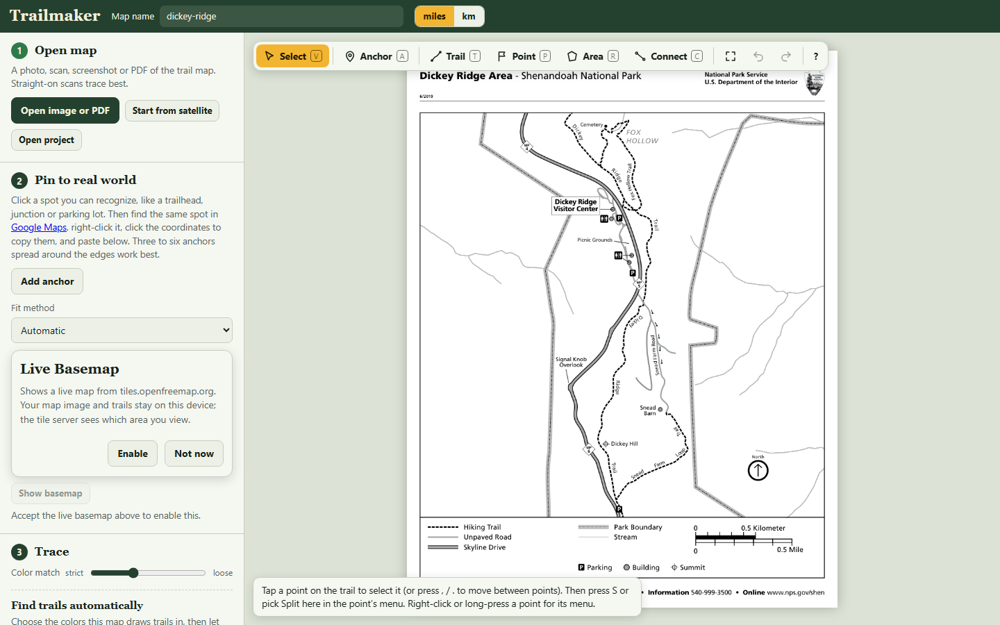
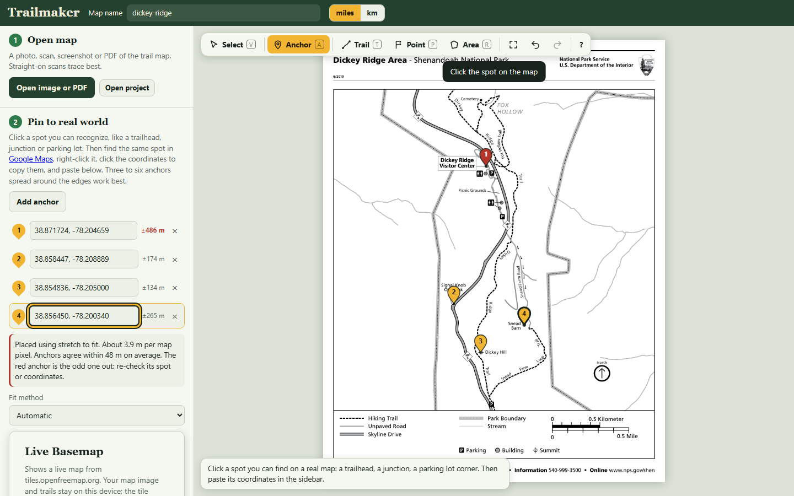
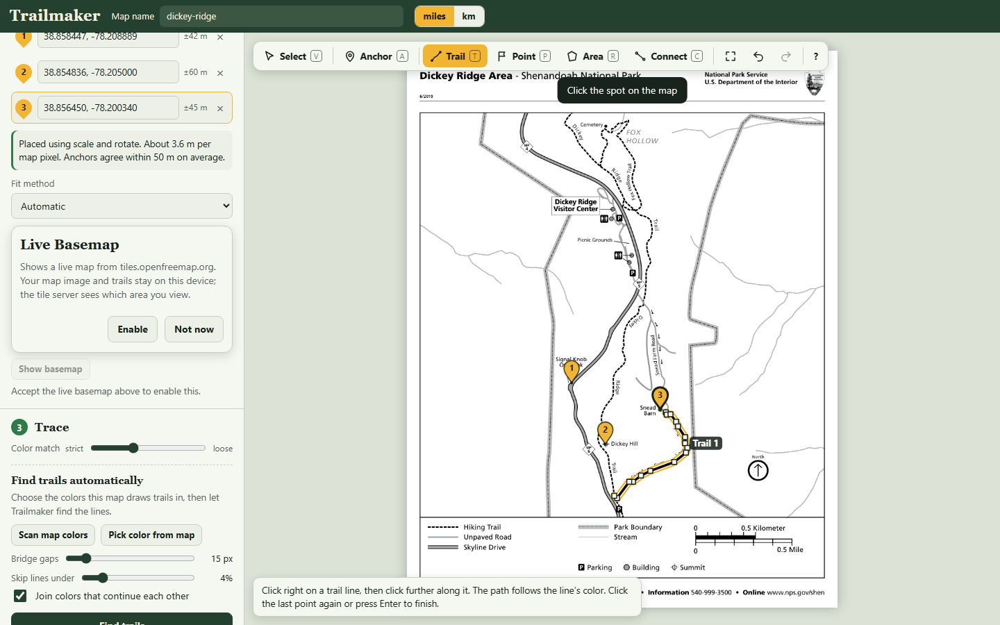
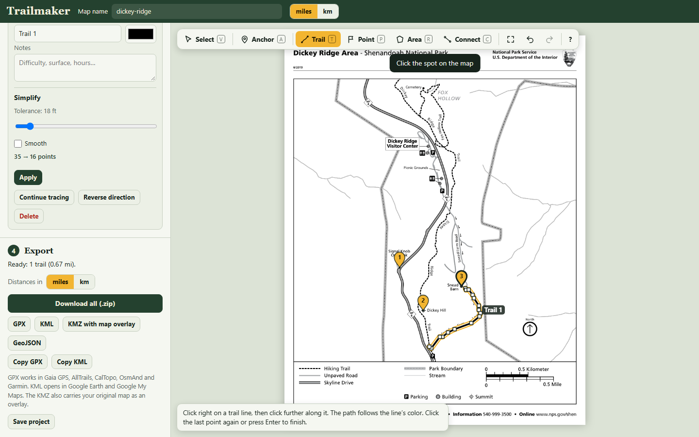

# Trailmaker

Trailmaker makes GPS trail files (GPX, KML, KMZ and GeoJSON) that work in Gaia GPS, AllTrails,
CalTopo, OsmAnd, Garmin and Google Earth. You can start from either:

- **A park or trail map** you already have: a photo, scan, screenshot or PDF. Pin a few spots to
  real coordinates, then trace the trails by hand or let Trailmaker find them by color.
- **Satellite imagery**, when there's no printed map. Frame an area, capture sharp aerial imagery
  as your map (US public-domain NAIP imagery, up to 0.3 m per pixel), and trace what you can see.

It runs entirely in your browser, works on phones and desktops, keeps working offline once
loaded, and installs as an app (PWA).

**Try it:** https://schwaaaat.github.io/trailmaker-app/

## Privacy

- **Your maps and trails stay on your device.** Opening, tracing, auto-tracing, fitting and
  exporting all run locally, in the page and a Web Worker. Autosave uses the browser's own storage
  (IndexedDB), and projects save as `.trailmaker` files on your disk.
- **Nothing goes over the network unless you turn it on.** Each optional feature says so first:
  - **Live basemap** (off until you click *Enable*). Map tiles come from `tiles.openfreemap.org`.
    Satellite view comes from USGS: NAIP aerial imagery (`imagery.nationalmap.gov`) and the USGS
    imagery basemap (`basemap.nationalmap.gov`). These servers see which area you're viewing; your
    map image and trails aren't sent.
  - **Esri World Imagery** is optional and only works with your own free ArcGIS API key. The key
    is stored in this browser only and sent only to Esri's tile server
    (`ibasemaps-api.arcgis.com`).
  - **Start from satellite** downloads imagery for the area you frame, from the USGS servers
    above.
  - **Place search** (a separate checkbox, off by default). It sends only the text you type to
    `nominatim.openstreetmap.org`.
- The *Google Maps* link in the anchors step is an ordinary link that you choose to open.

## Two-minute walkthrough

The screenshots use the public-domain NPS
[Dickey Ridge Area map](https://www.nps.gov/shen/planyourvisit/upload/DickeyRidgeArea_RoadTrail.pdf)
from Shenandoah National Park. It's in `tests/fixtures/real/`.

**1. Open the map.** Click **Open image or PDF**, or drop a file on the page. PDFs open on page 1;
switch pages from the **Page** menu for multi-page files. Straight-on scans trace best.



**2. Pin it to the real world.** Click **Add anchor**, then click a spot you can recognize, such as
a visitor center, trailhead, junction or overlook. Paste its coordinates (decimal,
degrees-minutes-seconds, or a Google Maps URL) and press Enter. Or open the basemap and tap the
same spot there. Use three to six spots spread across the map, not in a line.

Trailmaker fits the map and shows how well the anchors agree. If one is well off, it turns red so
you can re-check it. If the anchors can't check each other yet (for example, most of them lie on
one line), it says so and suggests where to add one. For warped or hand-drawn maps, pick
*Rubber sheet* under **Fit method**.



**3. Trace the trails.** Pick **Trail** in the toolbar (`T`). With **Follow the line's color while
tracing** on, click on the trail and then further along it; the path follows the ink between
your clicks. Finish with Enter or by clicking the last point again. Use **Point** for trailheads
and other points of interest, and **Area** for zones. To trace many trails at once, use **Find
trails automatically**: pick the trail colors, review the candidates, and accept them.



**4. Tidy up.**
- **Connect** (`C`): tap a point on one trail and a point on another, then choose **Straight**,
  **Follow the map** or **Draw it**. The ends lock onto both trails, so junctions where three or
  more trails meet stay exact.
- **Simplify**: with a trail selected, drag the slider to cut the point count ("412 → 38 points"),
  optionally smoothing it. Endpoints and junctions don't move.
- **Split and join**: select a point and press `S`, or right-click / long-press a point for its
  menu. **Join with…** joins two trails.

**5. Export.** In **Export**, choose **GPX** for Gaia GPS, AllTrails, CalTopo, OsmAnd or Garmin,
**KML** or **KMZ with map overlay** for Google Earth, or **GeoJSON**. **Download all (.zip)**
gives you every format. **Save project** writes a `.trailmaker` file you can reopen later.



## Making a map from satellite imagery

1. Click **Start from satellite** in step 1, and allow the basemap.
2. Pan and zoom to your park, and frame the area. The frame shows the image size and ground
   detail, for example "USGS NAIP · about 0.3 m per pixel". Zoom the map out to take in more.
3. Click **Capture map**. The imagery becomes your map, already pinned to the real world, so
   there are no anchors to place. Trace, connect, simplify and export as above.

In the lower 48 US states the capture uses **NAIP** aerial imagery (USDA, via USGS, 0.3–0.6 m per
pixel). Elsewhere, or where NAIP has no data, it falls back to the USGS imagery basemap (about
2 m per pixel) and tells you.

## Imagery sources and licenses

| Source | Used for | License |
|---|---|---|
| USDA NAIP via USGS The National Map | satellite view, capture | US government, public domain |
| USGS Imagery Only basemap | satellite view, capture fallback | US government, public domain |
| Esri World Imagery (your API key) | satellite view only | Esri terms. Tracing features is permitted; offline export isn't, so Trailmaker never captures it. |
| OpenFreeMap / OpenStreetMap | street basemap | © OpenStreetMap contributors |

Captured maps keep their imagery credit, and KML/KMZ exports include it.

## Phones and keyboards

On a phone the page scrolls as one column; the map, basemap and overlay become tabs. Pinch to
zoom, tap to trace, and long-press a point for its menu.

Every tool also works from the keyboard. Press `?` in the app for the full list. The toolbar keys
are `V` Select, `A` Anchor, `T` Trail, `P` Point, `R` Area and `C` Connect. To step between points,
use the arrow keys or `,` / `.`, and `<` `>` or `[` `]` to jump ten; that's handy on compact
keyboards without dedicated arrows. **Reset interface** in the help dialog puts the layout and
settings back to their defaults without touching your projects.

## Development

Requires Node 22.17 or newer and pnpm 10 (`corepack enable` picks up the pinned version).

```sh
pnpm install
pnpm dev               # Vite dev server
pnpm build             # typecheck + production build into dist/
pnpm preview           # serve the production build
```

Quality gates (all must pass before a merge):

```sh
pnpm typecheck         # strict TypeScript
pnpm lint              # ESLint, zero warnings
pnpm test              # Vitest with coverage (src/core >= 85% lines) + KMZ stress
pnpm fixtures          # regenerate the synthetic benchmark maps
pnpm test:e2e          # Playwright: golden flows, phones, imagery (all network stubbed), dev + preview
pnpm test:trace-bench  # tracer quality and speed on synthetic + NPS fixtures
pnpm gate              # all of the above, then build
```

To regenerate the README screenshots, run
`README_SHOTS=1 pnpm exec playwright test readme-screenshots`. On Windows PowerShell, set
`$env:README_SHOTS='1'` first.

Layout: `src/core` holds the pure TypeScript (geo fits, tracing, export, project format,
topology), `src/worker` the Comlink worker, `src/state` the Zustand store, `src/ui` the canvas
editor, panels, files and georeferencing, and `src/io` loading, imagery capture, autosave and the
PWA.

## License

MIT. See [LICENSE](LICENSE).

## Map sources

The NPS maps in `tests/fixtures/real/` are US government works in the public domain. Their
sources are listed in `tests/fixtures/real/README.md`.
